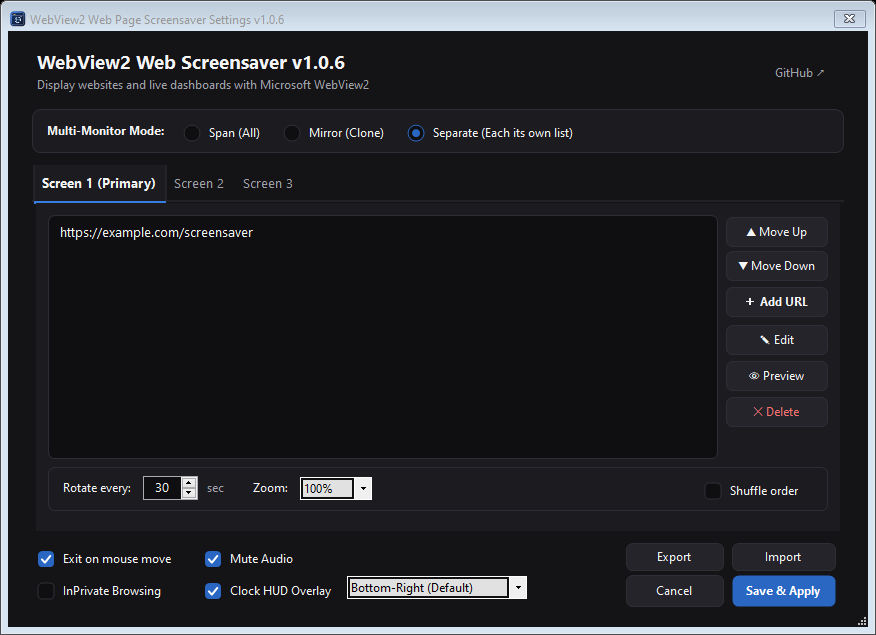
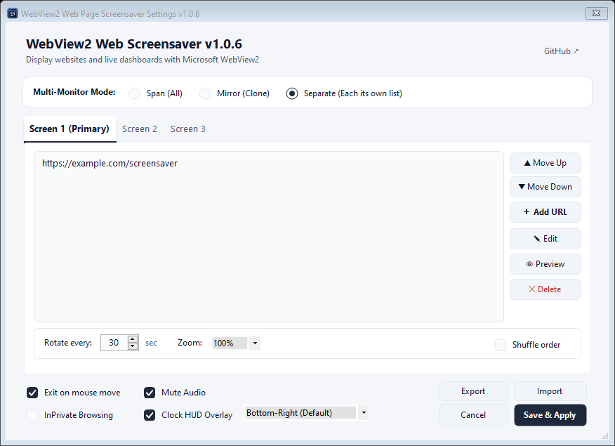

# WebView2 Web Page Screensaver

A Fork of the old archived project [ZenProjects/Chromium-Web-Page-Screensaver](https://github.com/ZenProjects/Chromium-Web-Page-Screensaver) that uses **Microsoft Edge WebView2 (Chromium)** in place of the [CefSharp WinForms](https://github.com/cefsharp/CefSharp) to display web pages as your screensaver.

## Features

- **Modern WebView2 Engine**: Chromium-based rendering with low resource usage.
- **Audio Mute**: Automatic sound muting during screensaver playback.
- **InPrivate Browsing**: Privacy mode leaving no browsing history, cache, or cookies.
- **Clock HUD Overlay**: Floating digital clock with 4 selectable screen corners.
- **Offline Digital Clock**: Graceful fallback neon clock when disconnected or page errors.
- **Live Web Preview**: Test URLs and display settings directly in the settings window.
- **Display Zoom Scaling**: Custom zoom levels (75%~200%) for 4K and QHD monitors.
- **Config Backup & Restore**: Single-click JSON export and import for easy migration.
- **Multi-Monitor Modes**: Span (Composite), Mirror (Clone), and Separate (Per-monitor URLs).
- **Custom Per-URL Duration**: Individual display times via `URL|seconds` format.
- **System Theme Sync**: Real-time Light and Dark mode switching with Windows theme.

## Dependencies

- [.NET Framework v4.8+](https://dotnet.microsoft.com/ko-kr/download/dotnet-framework/net48)
- [Microsoft Edge WebView2 Runtime](https://developer.microsoft.com/en-us/microsoft-edge/webview2/)
- Windows 11 & up

## Download and Install

- Download the ***[Latest WebView2 Web Screensaver binary](https://github.com/muro-dot/Webview2_WebPage_Screensaver/releases/latest)***  
- Unzip it to a permanent directory
- Find `Webview2_WebPage_Screensaver.scr` in the unziped directory, right click it
- Select `Install` to install, or `Test` to test it out without installing it
- If installing it, the windows `Screen Saver Settings` dialog will pop up with the correct screen saver already selected
- Use the `Settings...` button in the same dialog to change the web page(s) list displayed by the screen saver

## Build 

- Clone the source repository
- Open the `.sln` project file with Visual Studio (Tested with VS 2026).
- Restore NuGet packages to download the `Microsoft.Web.WebView2` dependency.
- Build in `Release` with `Any CPU` or `x64` mode
- Find `Webview2_WebPage_Screensaver.scr` in `bin/Release`
- Right click the `.scr` file, select `Install` to install, or `Test` to test it out
- Use the `Settings...` button to configure your custom URLs.

### Preview (Dark Mode / Light Mode)

| Dark Mode | Light Mode |
| :---: | :---: |
|  |  |
